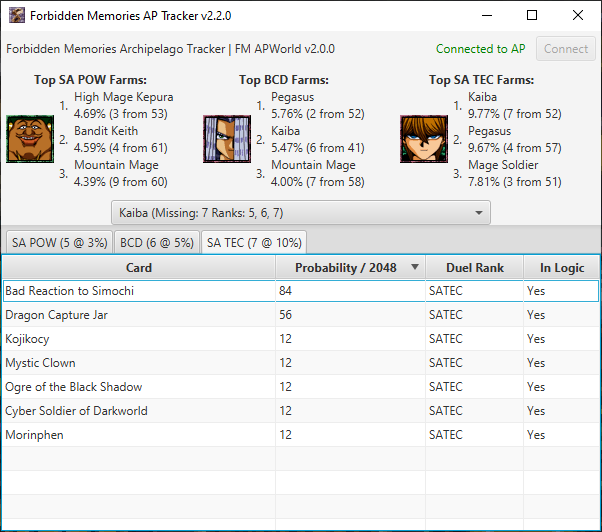

# Yu-Gi-Oh! Forbidden Memories Tracker for Archipelago

## How to get

Builds for Windows (x64) are available on the [Releases page](https://github.com/sg4e/FMArchipelagoTracker/latest).

Linux (x64 and ARM64) and macOS (x64 and ARM64 M1) are also supported by running from source. 32-bit architectures are not supported.

## Running from source

How to build and run from source:

1. Clone the repo with `git clone https://github.com/sg4e/FMArchipelagoTracker.git` or by clicking `"Code" > "Download ZIP"` and extracting.
2. [GraalVM 21 or later](https://www.graalvm.org/downloads/) is required. Download for your operating system. If using the automated scripts in the next step, extract to the root of the repo and rename to `graalvm-jdk`. Directly inside should be folders `bin`, `conf`, `include`, etc.
3. Run (double-click) one of the following scripts for your operating system:
    - For Windows, use `run_windows.bat`
    - For Linux and macOS, use `run_linux_macos.sh`